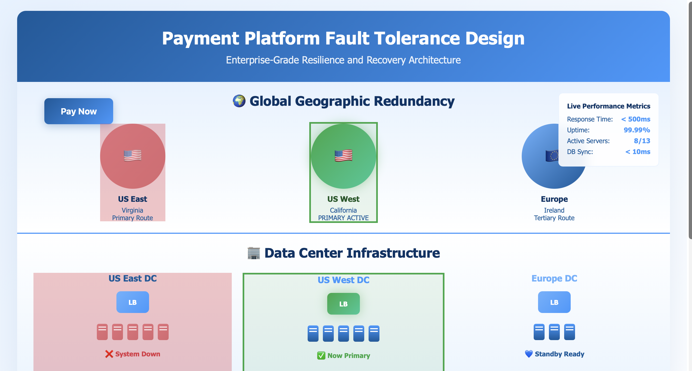

# FinTech Fault Tolerance Simulator

A visual simulation demonstrating how fault tolerance works in payment systems.

Part of the *FinTech Focus* blog series.

## What it shows

- Primary and backup payment paths
- Failover behavior during service disruption
- Basic resilience thinking in payment architecture

## Files

- `index.html` — simulator page
- `fintech-fault-tolerance-simulator-preview.png` — preview image